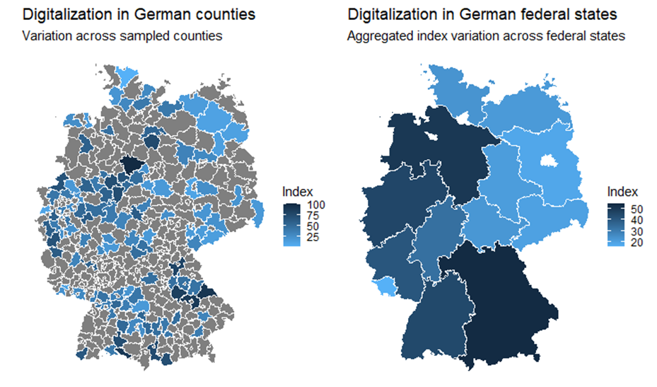

<div id="top"></div>
<!--
*** Thanks for checking out the Best-README-Template. If you have a suggestion
*** that would make this better, please fork the repo and create a pull request
*** or simply open an issue with the tag "enhancement".
*** Don't forget to give the project a star!
*** Thanks again! Now go create something AMAZING! :D
-->


<!-- PROJECT SHIELDS -->
<!--
*** I'm using markdown "reference style" links for readability.
*** Reference links are enclosed in brackets [ ] instead of parentheses ( ).
*** See the bottom of this document for the declaration of the reference variables
*** for contributors-url, forks-url, etc. This is an optional, concise syntax you may use.
*** https://www.markdownguide.org/basic-syntax/#reference-style-links

<!-- PROJECT LOGO -->
<br />
<div align="center">
  <a href="https://github.com/github_username/repo_name">
    
  </a>

<h3 align="center">Digitalization in the German county sphere</h3>

  <p align="center">
    An explorative analysis of influencing factors on Digitalization in the German county sphere
    <br />
    <a href="https://github.com/FelixCasp/DigitalizationinGermanCountySphere "><strong>Explore the docs »</strong></a>
  </p>
</div>


<!-- TABLE OF CONTENTS -->
<details>
  <summary>Table of Contents</summary>
  <ol>
    <li>
      <a href="#about-the-project">About The Project</a>
      <ul>
        <li><a href="#built-with">Built With</a></li>
      </ul>
    </li>
    <li>
      <a href="#getting-started">Getting Started</a>
      <ul>
        <li><a href="#prerequisites">Prerequisites</a></li>
      </ul>
    </li>
    <li><a href="#Dataset">Dataset</a></li>
    <li><a href="#Author">Author</a></li>
    <li><a href="#acknowledgments">Acknowledgments</a></li>
  </ol>
</details>


<!-- ABOUT THE PROJECT -->
## About The Project
This is a Github repository for the Master Thesis in Social and Economic Data Science at the University of Konstanz. 
The digital transformation is one of the greatest challenges Germany is facing, affecting not just urban but also peripheral regions critically. Enhanced public sector digitalization could bring these areas back into focus due to increased pressure in urban centers. But what factors contribute most to the digitalization of the public sector? Various current approaches in research focus on macroeconomic contexts at the state or city level. However comparably little is known about the fundamental interrelationships at the district level and in German rural areas. This work presents an exploratory dataset that utilizes 23 binary items to measure public sector digitalization operationalized by elementary fields of action in German counties. The items are combined into an index using factor scores derived via non-cognitive Item Response Theory. A stratified random sample of German counties is analyzed using a multilevel Bayesian model. In addition to existing literature, a clear correlation between educational drivers and public sector digitalization is observed also on county level. Furthermore, the paper finds that digitalization strategies can be beneficial for the local district public sector digitalization. 

<p align="right">(<a href="#top">back to top</a>)</p>


### Built With

* [Devtools](https://www.r-project.org/nosvn/pandoc/devtools.html)
* [Brms](https://paul-buerkner.github.io/brms/)
* [Brmstools](https://mvuorre.github.io/brmstools/)
* [Mirt](https://cran.r-project.org/web/packages/mirt/index.html)
* [SF](https://r-spatial.github.io/sf/)
* [BayesFactor](https://github.com/richarddmorey/BayesFactor)
* [Survey](https://cran.r-project.org/web/packages/survey/index.html)
* [MapSF](https://riatelab.github.io/mapsf/)

<p align="right">(<a href="#top">back to top</a>)</p>


<!-- GETTING STARTED -->
## Getting Started

When downloading the ZIP File the organisation of the repository should not be changed (e.g. move the shapefiles.)
Regardless of the package installations and preparations, r and rstudio as IDE must be installed. 

### Prerequisites

If not already installed on your device or environment, one has to prepare some basic steps. 
Rtools is needed in order to work with tools from many developers. See rtools for a guide on installation.
Another package, that is important for working more efficiently with packages in r is devtools.


* [rtools](https://cran.r-project.org/bin/windows/Rtools/rtools40.html)
* Devtools example 
  ```sh
  install.packages("devtools")
  ```
* Brms and brmstools installation
  ```sh
  devtools::install_github("paul-buerkner/brms")
  devtools::install_github("mvuorre/brmstools")
  ```
* Troubleshooting:
 I encountered some trouble when installing some packages or updating the packages using pacman. Manually installing/loading the packages sometimes
 did not help. A quick fix for me was to remove and re-install the rlang package or manually install the matrix package.
  
<p align="right">(<a href="#top">back to top</a>)</p>


<!-- Dataset -->
## Dataset

There are four different sources of data in my project

* Inkar_all_counties -> represents all the counties except kreisfreie städte together with relevant contextual data
* strata_sample -> the stratified randomly sampled counties populated with the 23 different binary items
* Shape.zip -> needs to be unzipped first, but not moved. Incorporates the shapefiles for geometric data on German counties and federal states
* Broadband -> Percentage of local population with access to at least 50 Mbit on the German county level 

<p align="right">(<a href="#top">back to top</a>)</p>

<!-- Author -->
## Author
Felix Caspari  - felix.caspari@uni-konstanz.de

<p align="right">(<a href="#top">back to top</a>)</p>


<!-- MARKDOWN LINKS & IMAGES -->
<!-- https://www.markdownguide.org/basic-syntax/#reference-style-links -->
[contributors-shield]: https://img.shields.io/github/contributors/github_username/repo_name.svg?style=for-the-badge
[contributors-url]: https://github.com/github_username/repo_name/graphs/contributors
[forks-shield]: https://img.shields.io/github/forks/github_username/repo_name.svg?style=for-the-badge
[forks-url]: https://github.com/github_username/repo_name/network/members
[stars-shield]: https://img.shields.io/github/stars/github_username/repo_name.svg?style=for-the-badge
[stars-url]: https://github.com/github_username/repo_name/stargazers
[issues-shield]: https://img.shields.io/github/issues/github_username/repo_name.svg?style=for-the-badge
[issues-url]: https://github.com/github_username/repo_name/issues
[license-shield]: https://img.shields.io/github/license/github_username/repo_name.svg?style=for-the-badge
[license-url]: https://github.com/github_username/repo_name/blob/master/LICENSE.txt
[linkedin-shield]: https://img.shields.io/badge/-LinkedIn-black.svg?style=for-the-badge&logo=linkedin&colorB=555
[linkedin-url]: https://linkedin.com/in/linkedin_username
[product-screenshot]: images/screenshot.png
